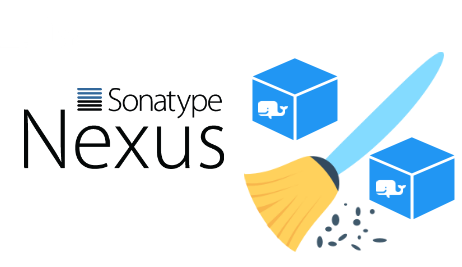
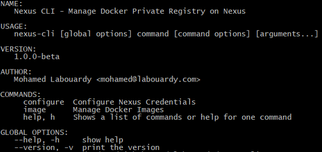

[](https://circleci.com/gh/mlabouardy/nexus-cli) [](LICENSE)

<div align="center">

</div>

Nexus CLI for Docker Registry

## Usage

<div align="center">

</div>

## Download

Below are the available downloads for the latest version of Nexus CLI (1.0.0-beta). Please download the proper package for your operating system and architecture.

### Linux:

```
wget https://s3.eu-west-2.amazonaws.com/nexus-cli/1.0.0-beta/linux/nexus-cli
```

### Windows:

```
wget https://s3.eu-west-2.amazonaws.com/nexus-cli/1.0.0-beta/windows/nexus-cli
```

### Mac OS X:

```
wget https://s3.eu-west-2.amazonaws.com/nexus-cli/1.0.0-beta/osx/nexus-cli
```

### OpenBSD:

```
wget https://s3.eu-west-2.amazonaws.com/nexus-cli/1.0.0-beta/openbsd/nexus-cli
```

### FreeBSD:

```
wget https://s3.eu-west-2.amazonaws.com/nexus-cli/1.0.0-beta/freebsd/nexus-cli
```

## Installation

To install the library and command line program, use the following:

```
go get -u github.com/mlabouardy/nexus-cli
```

## Available Commands

```
$ nexus-cli configure
```

```
$ nexus-cli image ls
```

```
$ nexus-cli image tags -name mlabouardy/nginx
```

```
$ nexus-cli image info -name mlabouardy/nginx -tag 1.2.0
```

```
$ nexus-cli image delete -name mlabouardy/nginx -tag 1.2.0
```

```
$ nexus-cli image delete -name mlabouardy/nginx -keep 4
```

```
$ nexus-cli image size -name mlabouardy/nginx
```
## Tutorials

* [Cleanup old Docker images from Nexus Repository](http://www.blog.labouardy.com/cleanup-old-docker-images-from-nexus-repository/)
